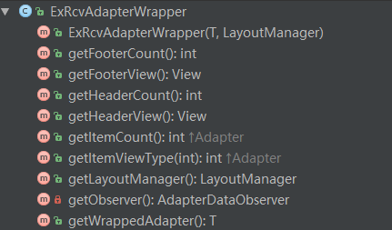

# ExRecyclerView  
### 在`ExRcvAdapterWrapper`中可以设置头、底操作：   

   

```JAVA
mAdapter = initAdapter();
// 支持传入已有的recyclerView的adapter，用它做个包装
ExRcvAdapterWrapper adapterWrapper = new ExRcvAdapterWrapper<>(mAdapter, layoutManager);
adapterWrapper.setHeaderView(mHeaderView); // 设置头
adapterWrapper.setFooterView(mFooterBtn); // 设置底
        
mRecyclerView.setAdapter(adapterWrapper);
```

----

### 可利用`OnRecyclerViewScrollListener`监听滑动到顶部、底部的事件，还可以监听滑动的距离     

    

```JAVA 
        mRecyclerView.addOnScrollListener(new OnRcvScrollListener() {
            @Override
            public void onScrollUp() {
                
            }

            @Override
            public void onScrollDown() {

            }

            @Override
            public void onBottom() {

            }

            @Override
            public void onScrolled(int distanceX, int distanceY) {

            }
        });
```
 

## 使用方式  
  
1.添加JitPack仓库
  
```  
repositories {
	maven {
		url "https://jitpack.io"
	}
}
```   

2.添加依赖  

```  
dependencies {
	compile 'com.github.tianzhijiexian:ExRecyclerView:1.1.1'
}    
```  

如果你想要最轻量的方式，可以直接复制里面的类到你的项目中即可。本项目中的类都是完全独立的，可以组合到不同的场景中。

## 截图  
  
   
  

  


## 开发者
 

Jack Tony: <developer_kale@.com>  


## License

    Copyright 2015 Jack Tony

    Licensed under the Apache License, Version 2.0 (the "License");
    you may not use this file except in compliance with the License.
    You may obtain a copy of the License at

       http://www.apache.org/licenses/LICENSE-2.0

    Unless required by applicable law or agreed to in writing, software
    distributed under the License is distributed on an "AS IS" BASIS,
    WITHOUT WARRANTIES OR CONDITIONS OF ANY KIND, either express or implied.
    See the License for the specific language governing permissions and
    limitations under the License.

 
